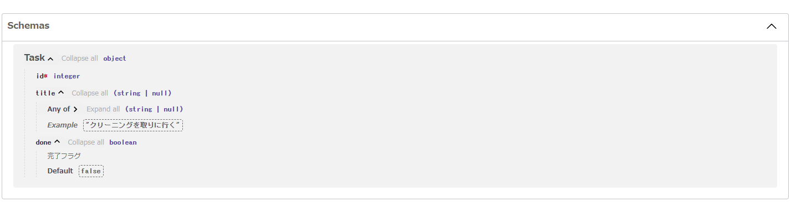

# FastAPI入門

## ソース
- https://zenn.dev/sh0nk/books/537bb028709ab9

## 注意
- pytest-asyncioのバージョンの違いから本通りに動かしてもテスト通らない
- これでいける
  - `docker-compose run --entrypoint "poetry run pytest --asyncio-mode=auto" demo-app`


## メモ

### FastAPI概要
- 自動的にSwagger UIのドキュメントが生成される
- スキーマ駆動開発
- ASGIに対応していて非同期処理ができて高速
- 基本的な書き方は以下
```python
from fastapi import FastAPI

app = FastAPI()

@app.get("/hello")
async def hello():
    return {"message": "hello world!"}
```
- appはFastAPI()インスタンス
- このときlocalhost:8000/helloでこのAPIがたたかれる
- localhost:8000/docsにswagger UI
  - swagger UI上でAPIたたくこともできる
### パスオペレーション関数
- 以下のようにFastAPIインスタンスに対するデコレータで修飾された関数のこと
```python
@app.get("/hello")
async def hello():
    return {"message": "hello world!"}
```
- パスは/helloの部分
- オペレーションはgetの部分, つまりHTTPメソッドのこと
### `__init__.py`
- https://qiita.com/msi/items/d91ea3900373ff8b09d7


### uvicorn


### ASGI


### Optional
- Noneを返す場合のある関数の型ヒントを書くのに使う
```python
from pathlib import Path
from typing import Optional

def get_latest_log_path(search_dir: Path) -> Optional[Path]:
```
- Python3.10以降では以下のようにかける
```python
from pathlib import Path

def get_latest_log_path(search_dir: Path) -> Path | None:
```

### レスポンス型の定義
- pydanticを使って以下のように定義できる
```python
from pydantic import BaseModel, Field

class Task(BaseModel):
    id: int
    title: Optional[str] = Field(None, example="クリーニングを取りに行く")
    done: bool = Field(False, description="完了フラグ")
```
- `BaseModel`を継承する形でスキーマモデルを定義
- 各フィールド`id`,`title`,`done`に対して`int`,`Optional[str]`,`bool`の型ヒントを付加している
- `Field`はフィールドに関する付加情報を記述
  - 第一引数はデフォルト値
  - `example`は値の例
  - `description`は説明
  - `example`, `description`で指定したものがSwaggerで表示される



- この型を使用してAPIのレスポンスを以下のように定義できる
```python
from typing import List
@router.get("/tasks", response_model=List[task_schema.Task])
async def list_tasks():
  return [task_schema.Task(id=1, title="1つ目のTODOタスク")]
```

### リクエスト型の定義
- POST /taskでタスクを新規作成する際にリクエストボディでtitleのみを指定する
- このとき、POST /taskのリクエストボディとGET /taskのレスポンスボディでtitleが共通なので以下のようにかく
```python
from typing import Optional

from pydantic import BaseModel, Field

class TaskBase(BaseModel):
    title: Optional[str] = Field(None, example="クリーニングを取りに行く")

class TaskCreate(TaskBase):
    pass

class TaskCreateResponse(TaskCreate):
    id: int

    class Config:
        orm_model = True

class Task(TaskBase):
    id: int
    done: bool = Field(False, description="完了フラグ")

    class Config:
        orm_mode = True
```
- このようにBaseModelを継承する形で共通フィールドをTaskBaseというクラスに持たせる
- このTaskBaseを継承する形で、POST /taskのリクエストとレスポンス、GET /taskのレスポンスを作成する
- APIでリクエストボディの型は以下のようにかく
  - レスポンスはデコレータを使ってrouterの引数
  - リクエストは関数の引数で型ヒント
- `Config`で`orm_mode=True`と記述することで暗黙的にORMを受け取り、DBモデルであるmodels.taskにあるtask型をレスポンススキーマであるschemas.taskにあるTaskCreateResponseに変換してくれる
```python
@router.post("/tasks", response_model=task_schema.TaskCreateResponse)
async def create_task(task_body: task_schema.TaskCreate):
    return task_schema.TaskCreateResponse(id=1, **task_body.dict())
```
- また、リクエストパラメータは`{}`をパスに埋め込んでその変数を引数として与える
```python
@router.delete("/tasks/{task_id}", response_model=None)
async def delete_task(task_id: int):
    return
```


### キーワード引数とdict
- `dict`インスタンスに対して先頭に`**`をつけることで`dict`をキーワード引数として展開できる
```python
task_schema.TaskCreateResponse(id=1, **task_body.dict())
```
- `task_schema.TaskCreateResponse(id=1, title=task_body.title, done=task_body.done)`と等価

### SQLAlchemyとは
- https://qiita.com/arkuchy/items/75799665acd09520bed2
- SQLアルケミー
- pythonのORMの1つ
- SQLAlchemyではDB接続設定->マッピング->セッション作成を行いそのセッションを使用してDB操作が可能
1. **DBエンジンの作成**
```python
from sqlalchemy import create_engine
engine = create_engine("{dialect}+{driver}://{username}:{password}@{host}:{port}/{database}?charset={charset_type})
```
| 変数名     | 説明                                                   |
|------------|--------------------------------------------------------|
| dialect    | 使用するデータベースの種類。例: `mysql`, `postgresql`   |
| driver     | データベースに接続するためのドライバー。例: `pymysql`, `psycopg2` |
| username   | データベースに接続するためのユーザー名                 |
| password   | データベースに接続するためのパスワード                 |
| host       | データベースサーバーのホスト名またはIPアドレス         |
| port       | データベースサーバーがlistenしているポート番号       |
| database   | 接続したいデータベースの名前                           |
| charset_type | データベース接続時に使用する文字エンコーディング。例: `utf8` |

- 今回の以下ではパスワードを省略している
```python
# api/db.py
ASYNC_DB_URL = "mysql+aiomysql://root@db:3306/demo?charset=utf8"
async_engine = create_async_engine(ASYNC_DB_URL, echo=True)
```
- `echo=True`にすると実行したSQL文がログに表示される

2. **モデルクラスの作成(テーブル定義)**
- まずモデルベースクラスを以下のように作成する
```python
from sqlalchemy.ext.declarative import declarative_base
Base = declarative_base()
```
- これを継承する形でモデルクラスを定義することでテーブルをマッピングさせられる
- このときメソッドも定義できる
```python
from sqlalchemy.schema import Column
from sqlalchemy.types import Integer, String

class User(Base):
    __tablename__ = "user"  # テーブル名を指定
    user_id = Column(Integer, primary_key=True)
    first_name = Column(String(255))
    last_name = Column(String(255))
    age = Column(Integer)

    def full_name(self):  # フルネームを返すメソッド
        return "{self.first_name} {self.last_name}"
```

3. **セッションの作成**
- SQLAlchemyはセッションを介してクエリを実行する
- セッションとは、コネクションを確立してから切断するまでの一連の単位のこと
```python
from sqlalchemy.orm import sessionmaker
SessionClass = sessionmaker(engine)  # セッションを作るクラスを作成
session = SessionClass()
```
- 今回は以下
```python
async_session = sessionmaker(
    autocommit=False, autoflush=False, bind=async_engine, class_=AsyncSession
)
```
- `autocommit=False`は明示的にトランザクションをコミットする必要がある設定
- `autoflush=False`は自動でデータをフラッシュしない設定
- `bind=async_engine`でセッションが使用するエンジンを指定
- `class_=AsyncSession`でセッションのクラスを非同期バージョンに指定
- また、flushとはセッション内で追跡されている変更をデータベースに反映させる操作のことを意味する
- `autoflush=True`の場合、以下のコードではクエリが実行される前にオブジェクトのdbに対するinsertが自動で行われる
```python
session.add(new_object)
result = session.query(SomeModel).all()
```
- 一方で、`autoflush=False`の場合、クエリの実行前にフラッシュが行われないため以下のようにする
```python
session.add(new_object)
session.flush()  # これを呼び出すことで、変更をデータベースに反映
result = session.query(SomeModel).all()
```


4. **CRUD処理**
- セッションを使用してDBをたたける
- INSERT
```python
user_a = User(first_name="first_a", last_name="last_a", age=20)
session.add(user_a)
session.commit()
```
- SELECT
```python
users = session.query(User).all()  # userテーブルの全レコードをクラスが入った配列で返す
user = session.query(User).first()  # userテーブルの最初のレコードをクラスで返す
```
- UPDATE
```python
user_a = session.query(User).get(1)  # 上で追加したuser_id=1のレコード
user_a.age = 10
session.commit()
```
- DELETE
```python
user_a = session.query(User).get(1)
session.delete(user_a)
session.commit()
```
### aiomysqlとは
- MYSQL向けに非同期IO処理を提供するライブラリ


### yield
- https://www.sejuku.net/blog/23716
- `yield`は以下のように使える
```python
def myfunc():
　　　　yield 'one'
　　　　yield 'two'
　　　　yield 'three'
for x in myfunc():
　　　　print(x)
```
```
// 実行結果
one
two
three
```
- ジェネレータに対して`next`を以下のように使える
```python
def myfunc():
    yield 'one'
    yield 'two'
    yield 'three'
 
generator = myfunc()
 
print(next(generator))
print(next(generator))
print(next(generator))
```
```
// 実行結果
one
two
three
```
- `yield from`は以下のように使える
```python
def generator1():
    yield 'one'
 
def generator2():
    yield 'two'
 
def generator(g1, g2):
    yield from g1
    yield from g2
 
gen = generator(generator1(), generator2())

for x in gen:
    print(x)
```
```
one 
two
```


### コルーチン
- https://qiita.com/koshigoe/items/054383a89bd51d099f10
- コルーチンとはプロぐらミグの構造の一種
- サブルーチンがエントリーからリターンまでを1つの処理単位とするのに対して、コルーチンはいったん処理を中断した後、続きから処理を再開できる
- Pythonでは`yield`を使ったジェネレータでコルーチンを実装できる
  - `yield`で処理を中断して再開できるから
- ジェネレータオブジェクト(ジェネレータ関数の戻り値)をnext()関数に与えることで、`yield`までステップを進めて停止できる(yield式を評価した時点で処理が中断される)
```python
def yes():
    """
    >>> yes_man = yes()
    >>> print(next(yes_man))
    A
    B
    yes
    >>> print(next(yes_man))
    C
    B
    yes
    >>> print(next(yes_man))
    C
    B
    yes
    """
    print 'A'
    while True:
        print 'B'
        yield 'yes'
        print 'C'
```
- また、ジェネレータに値を送信することもできる
```python
from functools import wraps

def coroutine(f):
    @wraps(f)
    def primer(*args, **kwargs):
        g = f(*args, **kwargs)
        next(g)
        return g
    return primer

@coroutine
def recv():
    """
    >>> receiver = recv()
    Started.
    >>> receiver.send(1)
    Receive: 1
    >>> receiver.send(2)
    Receive: 2
    >>> receiver.send(3)
    Receive: 3
    """
    print('Started.')
    while True:
        v = yield
        print(f'Receive: {v}')
```


